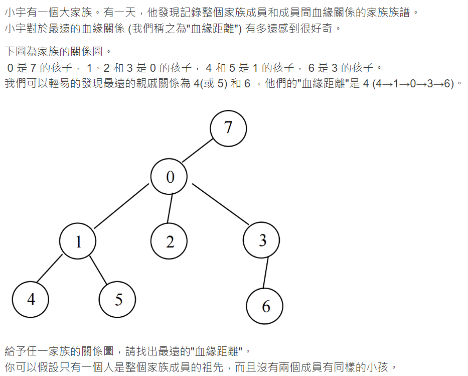

# 這裡會寫我的解題過程

## 開始時間: 2024/04/22 [血緣關係](https://zerojudge.tw/ShowProblem?problemid=b967)


首先我的想法就是bfs兩次，具體的作法是任意找一點做bfs
，以此找到最深的點，然後再從最深的點做bfs到另一個最深的點，
並計算他們之間的距離。

### 遇到的問題:
1. 我一開始只用有向圖的方式去存，
    這樣bfs時會發生父節點無法遍歷
   1. 解決方法:既然有向圖會出問題，那就做成無向圖!
2. 怎麼計算距離?
   1. 我一開始想說我在每一個點遍歷鄰居完後加一個-1以表示一層
   ，然後計算-1的數量當作兩點之間的距離，可是這會出現一個問題，
   就是葉節點也會推入-1所以就無法得知真實距離
   ```cpp=
   while (!bfs.empty()) {
        int temp = bfs.front();

        if (temp == -1) {
            counter++;
            bfs.pop();
            temp = bfs.front();
        }
        bfs.pop();

        for(int i : relationTree[temp]) {
            if (!visited[i]) {
                bfs.push(i);
                visited[i] = true;
            }
        }
        
        bfs.push(-1);
    }
   ```
   #### **最終解法:**
   我最後在書上看到了一種方法，也就是我現在用的方法 
   ，就是紀錄每個點跟開始的點的距離
   ，每當向下一層去時，下一層的距離就是這一層的距離加一
   ```cpp=
   while (!bfs.empty()) {
        int temp = bfs.front();
        bfs.pop();

        for(int i : relationTree[temp]) {
            if (!visited[i]) {
                bfs.push(i);
                visited[i] = true;
                distance[i] = distance[temp]+1;
            }
        }
    }
   ```
#### 完成時間: 2024/04/28
