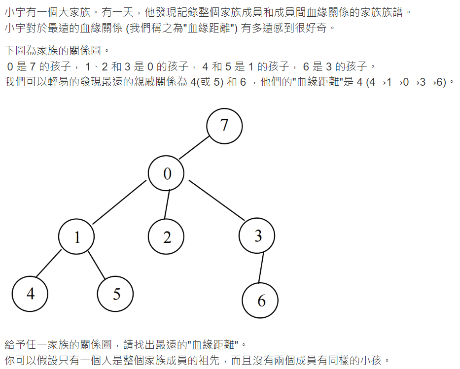
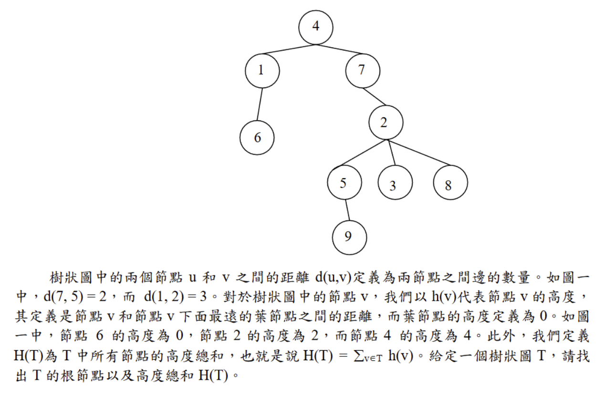

# 這裡會寫我的解題過程

## 2024/04/22 [血緣關係](https://zerojudge.tw/ShowProblem?problemid=b967)



首先我的想法就是bfs兩次，具體的作法是任意找一點做bfs，以此找到最深的點，然後再從最深的點做bfs到另一個最深的點， 並計算他們之間的距離。

### 遇到的問題:
1. 我一開始只用有向圖的方式去存，這樣bfs時會發生父節點無法遍歷
   1. 解決方法:既然有向圖會出問題，那就做成無向圖!
2. 怎麼計算距離?
   1. 我一開始想說我在每一個點遍歷鄰居完後加一個-1以表示一層 ，然後計算-1的數量當作兩點之間的距離，可是這會出現一個問題
   ，就是葉節點也會推入-1所以就無法得知真實距離
   ```cpp
   while (!bfs.empty()) {
        int temp = bfs.front();

        if (temp == -1) {
            counter++;
            bfs.pop();
            temp = bfs.front();
        }
        bfs.pop();

        for(int i : relationTree[temp]) {
            if (!visited[i]) {
                bfs.push(i);
                visited[i] = true;
            }
        }
        
        bfs.push(-1);
    }
   ```
   #### **最終解法:**
   我最後在書上看到了一種方法，也就是我現在用的方法，就是紀錄每個點跟開始的點的距離，每當向下一層去時，下一層的距離就是這一層的距離加一
   ```cpp
   while (!bfs.empty()) {
        int temp = bfs.front();
        bfs.pop();

        for(int i : relationTree[temp]) {
            if (!visited[i]) {
                bfs.push(i);
                visited[i] = true;
                distance[i] = distance[temp]+1;
            }
        }
    }
   ```
#### 完成時間: 2024/04/28

## 2024/04/29 [樹狀圖分析](https://zerojudge.tw/ShowProblem?problemid=c463)

題目有兩個要求(找根節點和H(T))
1. 首先根節點我是直接利用set，先將所有點加入set，將每個輸入的子節點移除，最後剩下的就是根節點。
2. H(T)我原本想說直接從根節點dfs，然後計算每個點與根節點的距離，但題目的意思是計算每個節點到葉節點且為自己的子孫節點的距離。
因此要將做法改為從每一個葉節點開始dfs每個點取最大值。
```cpp
 vector<int> h(n+1, 0);
 for (auto leafPoint : leaf) {
     stack<int> dfs;
     dfs.push(leafPoint);

     vector<bool> visited(n+1, false);
     vector<int> distance(n+1, 0);
     visited[dfs.top()] = true;

     while (!dfs.empty()) {
         int temp = dfs.top();
         dfs.pop();
         if (temp == root) break;

         for (auto i : tree[temp]) {
             if (!visited[i]) {
                 visited[i] = true;
                 dfs.push(i);
                 distance[i] = distance[temp] + 1;
                 if (distance[i] > h[i]) h[i] = distance[i];
            }
        }
    }
 }
```
   1. 其中有一些細節需要注意:
      1. 由於此題是以1為底的，因此陣列長度要注意，而且for迴圈的次數也要注意。
#### 完成時間:2024/05/04
